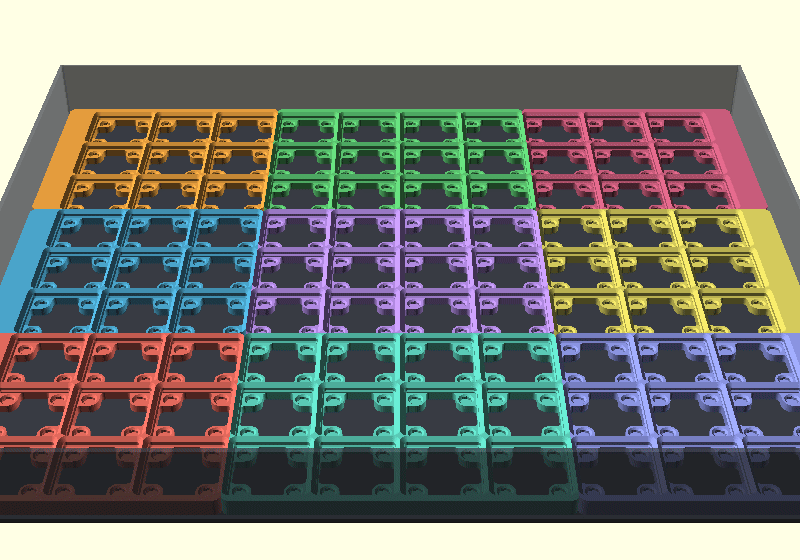
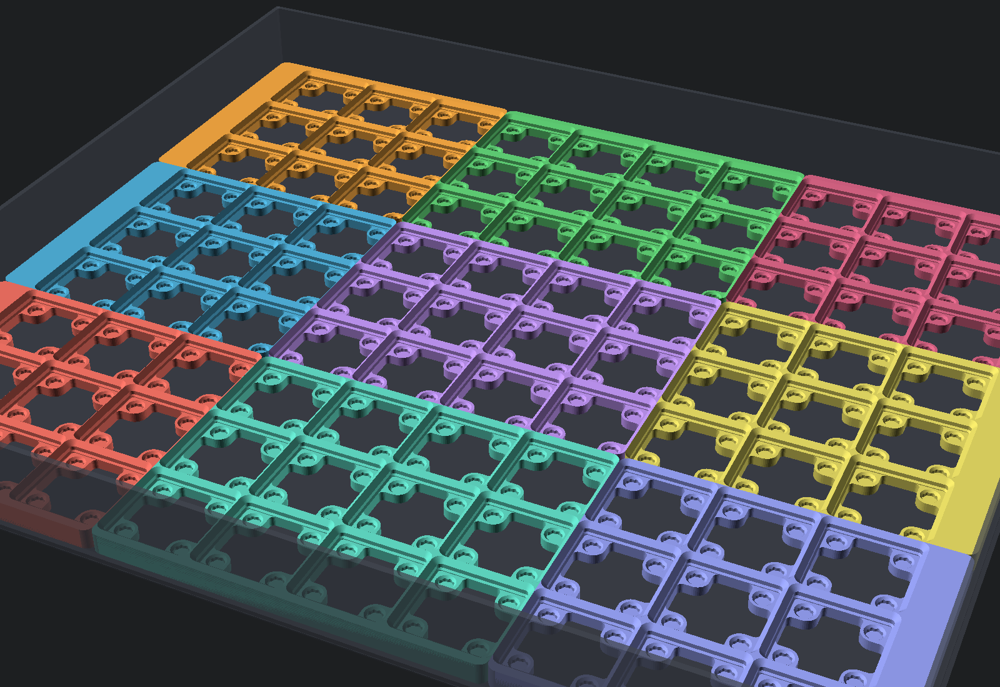
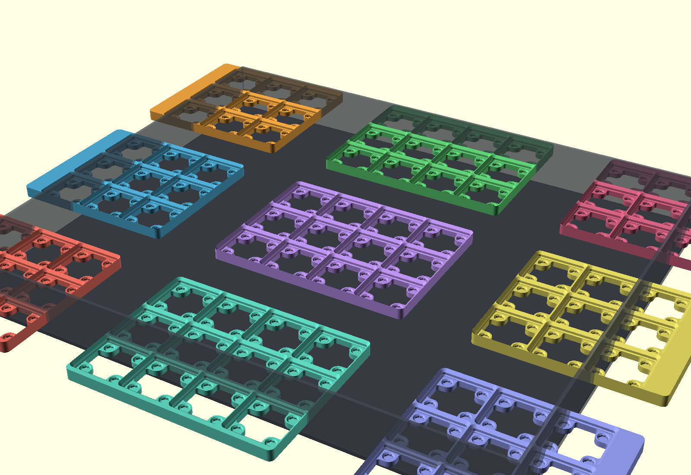
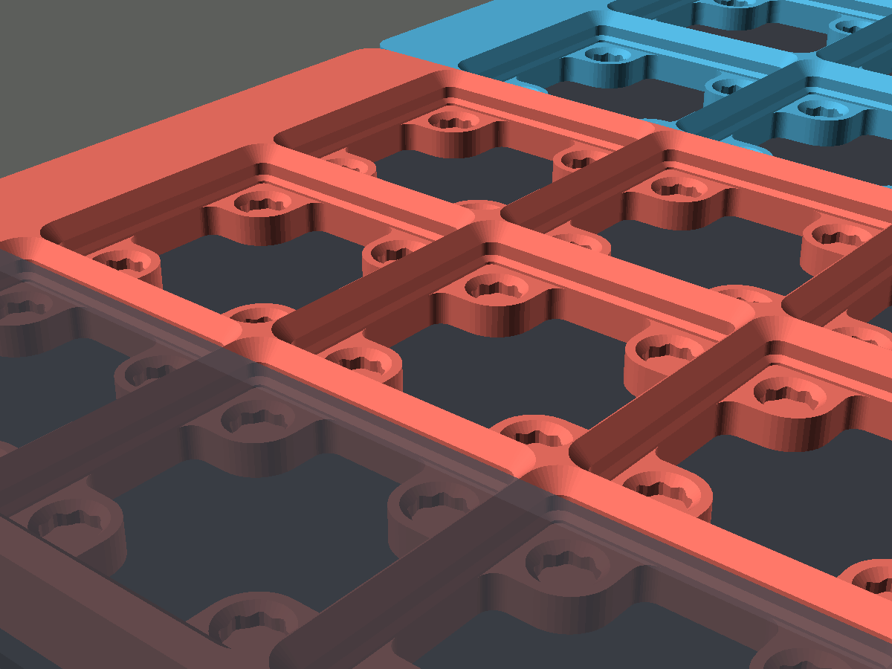
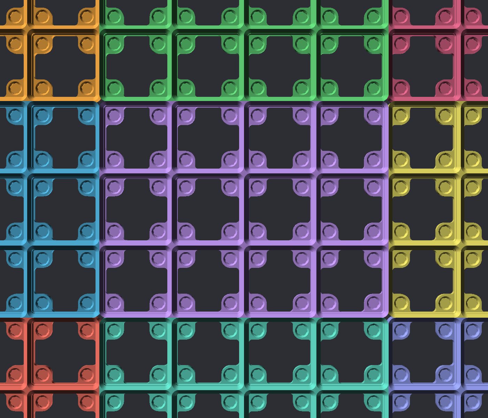

# Gridfinity Drawer Baseplates — 15 in × 20.5 cm

Custom [Gridfinity](https://gridfinity.xyz/) baseplates sized to exactly fill a drawer measuring **15 in × 20.5 cm (381 × 205 mm)**.

The drawer holds a **9 × 4 grid** of standard 42 mm Gridfinity squares. Since that's too wide for a single print on a Bambu (256 × 256 mm) bed, it's split into two plates that sit side by side.

## Files

| File | Grid | Printed size | Notes |
|---|---|---|---|
| `baseplate_left_5x4_fitted.stl` | 5 × 4 | 212.5 × 204.5 mm | Extra margin on left + back edges |
| `baseplate_right_4x4_fitted.stl` | 4 × 4 | 168.0 × 204.5 mm | Extra margin on right + back edges |
| `baseplate_5x4.stl` | 5 × 4 | 210 × 168 mm | Plain grid, no drawer padding |
| `baseplate_4x4.stl` | 4 × 4 | 168 × 168 mm | Plain grid, no drawer padding |

The `_fitted` plates use the fit-to-drawer padding so the pair fills the drawer edge-to-edge (380.5 × 204.5 mm total — 0.5 mm clearance so they don't jam). The plain plates are included in case you want the grid-only version for a different drawer.

## Print settings

- **Style**: thin baseplate (5 mm tall), no magnet or screw holes — sits loose in the drawer
- No supports needed, prints flat as-is
- 2 walls, 15% infill is plenty
- Any material works; PLA is fine for drawer use

## How they were generated

Rendered with [gridfinity-rebuilt-openscad](https://github.com/kennetek/gridfinity-rebuilt-openscad) by kennetek (MIT licensed):

```bash
# left plate (5×4, padded to 212.5 × 204.5)
openscad -o baseplate_left_5x4_fitted.stl \
  -D gridx=5 -D gridy=4 -D style_plate=0 -D style_hole=0 \
  -D distancex=212.5 -D distancey=204.5 -D fitx=-1 -D fity=1 \
  gridfinity-rebuilt-baseplate.scad

# right plate (4×4, padded to 168 × 204.5)
openscad -o baseplate_right_4x4_fitted.stl \
  -D gridx=4 -D gridy=4 -D style_plate=0 -D style_hole=0 \
  -D distancex=168 -D distancey=204.5 -D fitx=1 -D fity=1 \
  gridfinity-rebuilt-baseplate.scad
```

Gridfinity was created by [Zack Freedman](https://www.youtube.com/watch?v=ra_9zU-mnl8); any standard Gridfinity bin (Printables, MakerWorld, etc.) snaps onto these plates.

## Drawer 3 — 454.5 × 386 mm, magnetic (A1 mini)



| | |
|---|---|
|  |  |
|  |  |


`drawer3-magnetic/` — **10 × 9 grid** (90 squares) split into **9 plates** that each fit an A1 mini (180 mm bed). Skeletonized style, 9.35 mm tall, with pockets for **6 × 2 mm round magnets** (crush ribs + chamfer — press fit, no glue). Assembled size 454.0 × 385.5 mm (0.5 mm clearance).

| Position | Grid | Size (mm) |
|---|---|---|
| Front/Back Left+Right (4 pcs) | 3×3 | 143 × 129.75 |
| Front/Back Mid (2 pcs) | 4×3 | 168 × 129.75 |
| Mid Left+Right (2 pcs) | 3×3 | 143 × 126 |
| Mid Mid (1 pc) | 4×3 | 168 × 126 |

`GRIDFINITY_MAG_DRAWER_A1MINI.3mf` — all 9 pieces as 9 plates in one A1-mini-native project. Full magnet population = 4 per square = **360 magnets**; populating only under bins that need hold is normal.

Generated with gridfinity-rebuilt-openscad: `style_plate=2` (skeletonized), `enable_magnet=true`, fitted with `distancex/y` + `fitx/y` per piece (outer pieces carry the drawer padding: +17 mm on left/right columns, +3.75 mm on front/back rows).
